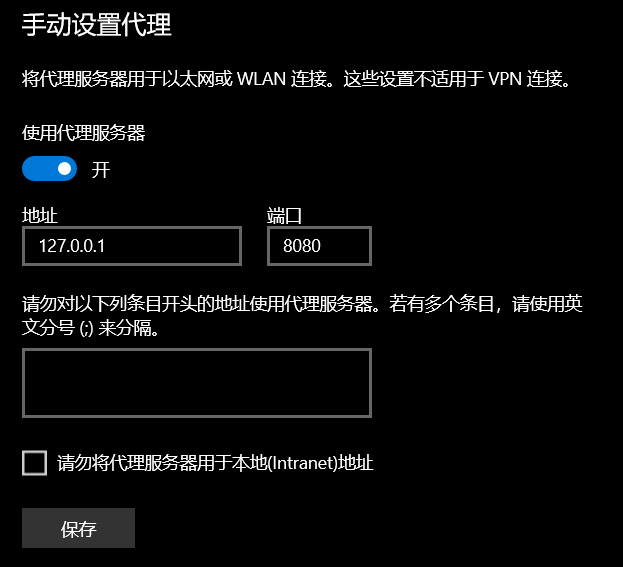
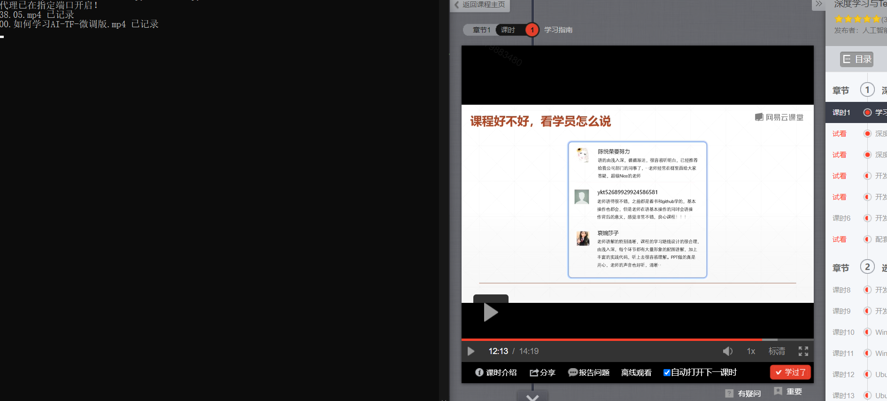

# 网易云课堂视频下载  
网易云课堂视频下载（包含原理介绍，在最后），支持所有类型视频，收费视频需要**购买过**的才能下载  


## 测试环境  
win10 + python3.7.5


## 其他版本  
推荐使用油猴脚本版，有可视化界面，操作更方便。  
[地址](https://greasyfork.org/zh-CN/scripts/435841-%E7%BD%91%E6%98%93%E4%BA%91%E8%AF%BE%E5%A0%82%E8%A7%86%E9%A2%91%E4%B8%8B%E8%BD%BD)


## 使用方法  


> **注意**，这只是为了练习python爬虫和一时的需求而产生的产物，并不是一个完善和长期的工具，不考虑使用的方便，请严格按照使用说明操作或依据原理自行完善修改


1. 安装依赖的第三方库  

    ```cmd
    pip install -r requirements.txt
    ```

    > `pycryptodome`用以进行AES解密  
    > `mitmproxy`用以拦截请求  
    > 其他一般的像`requests`等第三方库如有缺失请自行安装  

    请参照网上的教程**安装mitmproxy证书**，不然抓不到https包！！！  
    请参照网上的教程**安装mitmproxy证书**，不然抓不到https包！！！  
    请参照网上的教程**安装mitmproxy证书**，不然抓不到https包！！！  


2. 启动脚本  

    ```cmd
    python main.py
    ```

    如果没有报错，那么恭喜你，你的脚本**应该**是可以正常使用的。  


3. 设置代理  
    - 如果你没有对脚本做过修改，那么**默认**的代理地址为本机的8080端口，即`127.0.0.1:8080`。  
    - 打开你电脑的`网络设置` -> `代理`，开启代理服务，地址为`127.0.0.1`，端口为`8080`，注意**点击保存才能生效**。如果你找不到相关设置或不会设置，请自行询问度娘*电脑如何设置网络代理*。以下为win10代理设置截图：  
      


4. 获取视频信息  
    - 保证你的代理设置正确且生效，同时保持脚本的运行。  
    - 打开网易云课堂中你要下载的视频，让其播放，此时，你就能看见脚本运行界面显示**已记录**了该视频的相关信息。  
      
    > **注意**，这里的命名为**视频的名称**（即用户上传视频时视频文件的名称），而**非课程的名称**，所以，如果视频上传者瞎起名字的话，你看到的也可能是一堆乱七八槽的东西哈哈  
    - 如果脚本没有报错，也没有获取到任何东西，请检查你的代理。这是很好检查的，如果你的**代理设置未生效**，在脚本未运行的情况下，你是不能上网的。只有**代理和脚本全都正常生效**，你才能正常上网。而如果脚本正常运行了你还是上不了网，那就说明你的**代理设置错误**。  


5. 下载视频  
    - **关闭**你的代理和脚本，使电脑恢复到正常状态。
    - 运行下载脚本
    ```cmd
    python downloader.py
    ```
    - 下载脚本会根据之前记录的相关信息，下载你的视频。
    > **注意**，为了避免重复下载，你应该及时清理`msgs`和`keys`中的文件。在每次**获取信息前**，先将它们清空或换个地方保存吧。


## 原理介绍  
### 视频分析  
1. 网易云课堂的视频一共分为三大类：  
    - 免费视频和试看视频中有一部分是直接以**mp4**格式传输的，这类视频最好下载，即使不用脚本，自己抓一下包或打开浏览器的开发者工具，拿到视频地址就可以直接下载了。
    - 免费视频和试看视频中有一部分是以**未加密.ts**的形式传输的。前端会先拿到一个m3u8文件，里面记录了视频所有ts文件的地址，并且这些ts文件都没有经过加密。浏览器会按照m3u8文件，依次请求这些ts文件在前端播放。我们所要做的，就是下载这些ts文件并将它们拼接成mp4视频（单个ts文件其实也是可以用播放器打开的）。
    - 收费视频的传输方式其实和第二类差不多，不过收费视频的ts文件都是经过了加密的。前端在播放视频前，会先请求一个key文件，这里面存放的就是二进制的解密key，然后再用key对每个ts进行解密播放。

2. 痛点：  
    - 三类视频中前两种只靠抓包分析请求就能很轻易的解决。关键是第三种加密视频，虽然我们靠分析理清了全过程，但key文件仍然不是那么好拿的。
    - key文件的地址存在m3u8文件中，但它是个动态的地址，每次拿到的都不一样。且这个地址只能请求一次还有时限限制。
    - 分析js是个体力活，反爬的本质就是提高爬虫的成本（只要在前端，花时间总是能破解的）。为了一时所需去阅读大量的js代码，性价比太低了，所以我选择让浏览器代劳，我们直接拿结果就行。


### 拦截请求  
mitmproxy是一个代理模块，会在你指定的端口开启一个代理服务，所用通过这个端口的请求和响应都会被记录，你可以通过设置代理脚本对它们进行随意的改造，具体可以查看官方文档。  
所以，这个问题的解决方案就是通过mitmproxy获取我们所需的信息（比如key），存储后再进行下载。  
在`intercapters.py`文件的最后，你可以看到我一共加载了5个拦截器：  
    - `NameIntercapter`: 获取视频名称  
    - `FileIntercapter`: 获取加密视频的m3u8文件  
    - `NoneKeyIntercapter`: 获取未加密视频的m3u8文件  
    - `VideoIntercapter`: 获取mp4视频地址  
    - `KeyIntercapter`: 获取解密所需的key  
有了这5个拦截器，我们就能获取到全部三类视频下载所需要的信息。  
之后，再根据获取到的信息，对应三类视频的下载方式进行下载就行了。
